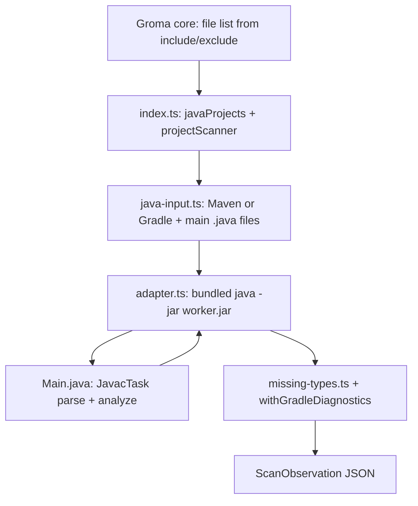

# Java scanner architecture

This page describes how the official Java scanner is structured, what it depends on,
and how it connects to Groma core. It is written for someone who knows TypeScript and
Java but is new to this repository. User-facing scan behavior lives in
[index.md](index.md); the executable plugin contract lives in
[creating-a-plugin.md](../creating-a-plugin.md).

## High-level shape

The Java scanner is a **two-layer plugin**:

1. **TypeScript host** — Implements Groma’s `ScannerPlugin` contract, discovers Maven
   and Gradle projects among the files core passes in, and merges observations from
   multiple projects.
2. **Bundled Java worker** — A precompiled JAR run on a custom **`jlink` runtime**
   that includes `jdk.compiler`. It parses and attributes Java source and prints a
   `ScanObservation` as JSON on stdout.

Groma core never invokes Maven, Gradle, or a system JDK. The host receives a filtered
file list, prepares per-project input, spawns the worker, and returns observation JSON.

In C4 terms, the curated component **Java scanner adapter** (`java-src-index` under
the CLI container) owns starting the worker and returning scan results and outlines.
The worker is implementation detail behind that adapter, not a separate architecture
element on the map.

## End-to-end flow



1. **`listSourceFiles`** — For each Maven or Gradle project directory among the
   candidates, read build metadata and list `.java` files under **main** source roots
   only (not test sources).
2. **`checkReadiness` / `scan`** — `projectScanner` splits the repository into project
   directories; each project receives a local subset of paths.
3. **`readJavaInput`** — When the project has compilable main Java sources, produce
   `{ root, release, encoding, files, name, kind, file }`.
4. **`scanJavaSource`** — Run
   `dist/<platform>-<arch>/runtime/bin/java -jar dist/worker.jar …` with stdin =
   one repository-relative path per line.
5. **Post-processing** — Fold unresolved-type javac diagnostics into
   `JAVA_MISSING_EXTERNAL_TYPES`; merge Gradle literal-parse warnings.

The plugin entry wires the host scanner and repository-level wrapping:

```ts
// plugins/scanners/java/src/index.ts (structure)
const scanner = {
  id: 'java',
  checkReadiness: …,
  readCodeStructure: readJavaOutline,
  scan: scanJavaSource,
}

export default {
  ...projectScanner(scanner, selectProjectDirectories),
  listSourceFiles: javaSources,
  scan: async (…) => {
    const projects = await javaProjects(…)
    const observation = await projectScanner(…).scan(…)
    return withGradleDiagnostics(summarizeMissingTypes(observation), projects.diagnostics)
  },
}
```

Multi-project behavior is shared with other scanners in
`plugins/scanners/project-scanner.ts`: select project directories, scan each with
paths relative to that directory, then **`relocateObservation`** and
**`combineObservations`**.

## TypeScript host: modules and roles

| Module | Responsibility |
| --- | --- |
| `plugins/scanners/java/src/index.ts` | Plugin surface: `id`, `listSourceFiles`, wrapped `scan`, Gradle diagnostic merge |
| `plugins/scanners/java/src/adapter.ts` | Bundled worker and runtime paths, readiness, scan and outline IPC |
| `plugins/scanners/java/src/process.ts` | `execFile` with stdin, timeout, large stdout buffer |
| `plugins/scanners/java/src/java-input.ts` | Maven vs Gradle; filter `*.java` under configured **main** roots |
| `plugins/scanners/java/src/maven.ts` | Lightweight POM XML tree parse (does not run `mvn`) |
| `plugins/scanners/java/src/gradle.ts` | **`good-enough-parser`** on Groovy and Kotlin DSL scripts; literal `srcDir` and Java version only |
| `plugins/scanners/java/src/missing-types.ts` | Collapse javac “cannot find symbol” and “package does not exist” into one info diagnostic |

### npm dependencies

From `plugins/scanners/java/package.json`:

- **`@groma/scanner`** — `ScannerPlugin`, `parseScanObservation`, `createScanObservation`, outline types.
- **`good-enough-parser`** — Gradle and settings script parsing only (not Java source).

### Manifest inputs

The scanner declares what it reads in **`groma.scanner.include`** (not in code):

- `**/*.java`, `**/pom.xml`, `**/build.gradle`, `**/build.gradle.kts`,
  `**/settings.gradle`, `**/settings.gradle.kts`
- Default **`exclude`**: `target/`, `build/`, `.gradle/`

Core applies global exclusions and Git ignore before calling `scan(repositoryRoot, settings, files)`.

## Java worker: analysis pipeline

Sources live under `plugins/scanners/java/java/md/groma/scanner/`. Entry point:
**`Main.java`**.

The worker uses **`JavacTask`** and **`Trees`** (Compiler Tree API):

- **Classpath is empty**; **source path** is the project root (so `module-info.java`
  on disk can bind locally without dependency JARs).
- **Parse** first; syntax errors fail the scan with every error listed.
- **Analyze** with attribution; only trees marked “authored” during parse are indexed.
- Emit JSON for schema version 1: roots, files and symbols, operations, invocations,
  HTTP facts, diagnostics.

Inside `analyze()`:

1. **`Declarations`** — symbols, operations (with **`Tokens`** for compared operations),
   entry points
2. **`Uses`** — invocations and unresolved calls
3. **`Http`**, **`HttpPaths`**, **`RetrofitRequests`**, **`OkHttpRequests`** — HTTP
   endpoints and requests from annotations and known client APIs in source
4. **`Outline`** — separate invocation mode:
   `java -jar worker.jar outline <repositoryRoot>` with file list on stdin; parser-only,
   no classpath

Design constraints (also summarized in [index.md](index.md)):

- No Maven or Gradle execution, no project dependency JARs, no build-generated outputs.
- Missing external types are expected; the scan continues with local facts.
- HTTP extraction is pattern-based on source (Spring, JAX-RS, Feign, and so on), not
  runtime-verified framework use.

## Build artifacts and runtime layout

Maintainers run `bun plugins/scanners/java/build.ts`, which:

1. Compiles worker sources with **JDK 21+** (`javac --release 21`).
2. Packages **`dist/worker.jar`** with main class `md.groma.scanner.Main`.
3. Runs **`jlink`** to produce **`dist/<os>-<cpu>/runtime`** with modules
   `jdk.compiler`, `java.xml`, `jdk.zipfs`.
4. Bundles the TypeScript entry to **`dist/package/src/index.js`** for consumers.

Published packages are self-contained: consumers do not need **`JAVA_HOME`** or a system
JDK. Maintainers need a JDK to build the plugin.

The host resolves bundled assets next to the installed package (`adapter.ts`):

- `../dist/worker.jar`
- `../dist/${process.platform}-${process.arch}/runtime/bin/java`

Readiness fails with `JAVA_WORKER_MISSING` or `JAVA_RUNTIME_MISSING` when those assets
are absent (for example an unpackaged dev tree without running `build.ts`).

## Integration with Groma core

- Listed in **`src/scanner/modules/official-catalog.ts`** as `@groma/scanner-java`.
- Implements the full official surface: `scan`, `checkReadiness`, `listSourceFiles`,
  `readCodeStructure`.
- Tests: `test-bun/java-scanner.test.ts`, `test-bun/java-gradle.test.ts`, and
  fresh-checkout validation without JDK on `PATH` (see
  [fresh-checkout validation](../fresh-checkout-validation.md)).

### OKF and C4 boundary

Scanner output is **temporary evidence** (roots, symbols, operations, HTTP facts,
diagnostics). It is not stored OKF knowledge and does not create C4 containers or
components. Core owns placement, relationships, and architecture Markdown. The plugin
must emit a complete `ScanObservation` only.

## Implications for a Scala scanner

The Java worker **cannot** read `.scala` files: javac does not parse Scala. A Scala
plugin should reuse the **host/worker split** and Groma contracts, but the worker must
use a Scala-aware parser. The recommended design is
[the Scala scanner proposal](../scala/proposal.md): one sbt 2 load per build to
learn `Compile` source directories, then a bundled Scala 3.9 parser. The notes
below are the survey that proposal decides.

### Patterns to reuse from Java

- **`projectScanner`** with **`combineObservations`** / **`relocateObservation`** for
  multi-module repositories.
- **Gradle literal parsing** as a starting point — today `gradle.ts` knows
  `src/main/java` and Java toolchain declarations only. Scala needs
  `src/main/scala`, Scala plugin blocks, cross-built roots, and related literals, either
  in a shared Gradle helper or a Scala-specific reader.
- **Maven POM tree parsing** if extended for `scala-maven-plugin`, `scala.version`, and
  Scala source directory properties (the Java reader today reads Java compiler settings
  only).
- **Diagnostic folding** for “missing external type” noise on an empty classpath, using
  Scala compiler message codes instead of javac’s.
- **Package layout**: `plugins/scanners/scala/`, maintainer `build.ts` bundling worker
  and runtime, `docs/scanners/scala/`, fixtures under `test/fixtures/`, and eventual
  entry in `official-catalog.ts`.

### Work that is Scala-specific

| Area | Notes |
| --- | --- |
| **Include list** | `**/*.scala`, `**/build.sbt`, `project/*.scala`, `project/build.properties`, plus Maven or Gradle files if those builds are supported |
| **Source listing** | Main vs test roots (`src/main/scala`, sbt `Test`, Gradle `sourceSets`) without running sbt or Gradle |
| **Worker engine** | scalac (2.13 vs 3.x differ), or SemanticDB / scalameta for a more uniform AST; must ship inside the package per the fresh-checkout rule |
| **Outline** | `object`, `trait`, `class`, `case class`, extension methods — map to the shared outline contract in [creating-a-plugin.md](../creating-a-plugin.md#source-outline) |
| **Operations and tokens** | Scala bodies for compared operations; anonymous callbacks and initializers analogous to Java’s rules |
| **HTTP** | Play, Akka HTTP / Pekko, http4s, tapir, and similar — new extractors; Java’s Spring and JAX-RS logic does not transfer |
| **sbt** | No in-repo equivalent today; likely literal `build.sbt` parsing (similar to Gradle) for `scalaVersion`, `Compile / scalaSource`, subprojects |

### Product decisions to settle early

1. **Scala 2 only, 3 only, or both** — affects worker packaging and APIs strongly.
2. **Mixed Java and Scala repositories** — enable both `java` and `scala` scanners vs one
   combined JVM scanner (Groma merges observations; outline ownership goes to the
   configured scanner with the lowest `id` on a file).
3. **Build tool priority** — sbt-first (typical Scala OSS) vs Gradle and Maven parity
   with the Java scanner.
4. **Evidence scope for a first version** — inventory and outline only vs invocations,
   compared-operation tokens, and HTTP (the Java worker is large largely because of call
   attribution and HTTP).

### Suggested implementation sequence

The sequence, package layout, and sbt boundary are specified in
[the Scala scanner proposal](../scala/proposal.md).

## Related documentation

- [Java scanner behavior and limits](index.md)
- [Creating a scanner plugin](../creating-a-plugin.md)
- [Scanner evidence semantics](../evidence.md)
- Curated map entry: `groma/systems/groma-md/containers/cli/components/java-src-index.md`
