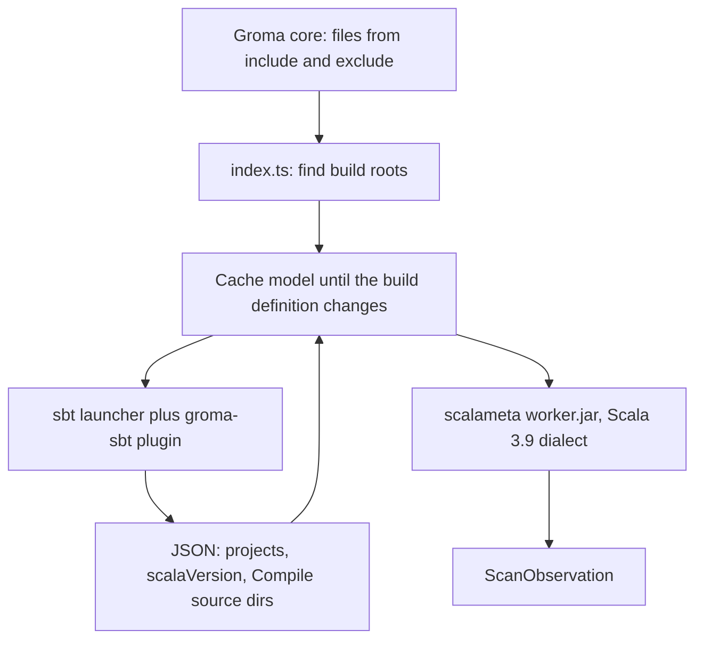

# Scala scanner proposal

This is a proposal for an official Scala scanner. It is not implemented behavior.
It follows the Java scanner’s host and worker split in
[architecture.md](../java/architecture.md) and the plugin contract in
[creating-a-plugin.md](../creating-a-plugin.md).

The recommended first version loads each sbt build once, asks sbt which
directories are main Scala sources, and parses those files with a bundled
scalameta worker. It does not compile the application, resolve library
dependencies, or typecheck.

The first version assumes one toolchain: the latest sbt 2 release, and Scala
3.9. It does not select a parser dialect per project and it does not carry an
sbt 1 plugin.

## Why this shape

A Scala architecture scan has to answer two different questions:

1. Which files belong to which project.
2. Which declarations, operations, and calls those files contain.

`build.sbt` and `project/*.scala` are Scala programs. sbt evaluates them.
Literal parsing, the approach the Java scanner uses for Gradle, cannot see a
source directory computed by a plugin, a `lazy val`, or `.settings(...)`.
Running sbt’s settings engine is the practical way to learn the `Compile`
source directories. `scalaVersion` is read only to reject a project that is
not Scala 3.9.

Parsing those sources does not require sbt. scalameta’s Scala 3.9 dialect
reads the source text. Shipping that parser inside the scanner keeps
declaration and outline extraction independent of the project’s library
classpath.

## OKF and C4

sbt projects and builds are source-analysis roots inside a `ScanObservation`.
They are not OKF documents and not C4 systems, containers, or components. An
ordinary Markdown reader keeps seeing curated architecture records and Code
links. Groma core owns placement and relationships. The plugin returns one
observation per scan and writes no architecture Markdown.

An sbt build is a source hierarchy (a build containing projects), the same way
a .NET solution contains projects. It does not prove an application boundary.

## Decisions

| Topic | Proposal |
| --- | --- |
| Build tool | Latest sbt 2 only. sbt 1, Gradle, Maven, Mill, and scala-cli are out of this version. |
| What sbt does | Load the build and export a source model. No `compile`, `test`, `run`, or `update` of library dependencies. |
| What reads `.scala` | Bundled scalameta worker, Scala 3.9 dialect, on a bundled JRE. |
| Scala versions | 3.9 only. The worker does not switch dialects. |
| Sources | `Compile` / unmanaged sources only. Tests and generated sources stay out. |
| Evidence | Symbols, outline, operations, syntactic body tokens, and same-file calls. No HTTP. |
| Java in the same repo | Separate scanner id `scala`. `.java` stays with the Java scanner. |
| User JDK | Not required. The scanner’s JRE is `JAVA_HOME` for the sbt launcher and the worker. |
| User sbt install | Not required. The package carries `sbt-launch.jar` pinned to the latest sbt 2 release at maintainer build time. |

## Flow



1. Core passes the scanner the files its include list names, after exclusions.
2. The host treats each directory that contains `build.sbt` as a build root.
   A nested `build.sbt` is its own build.
3. The host runs one sbt command for that build, unless a cached model is still
   valid. sbt prints one JSON document and exits.
4. The host keeps every `.scala` file that lies under a reported `Compile`
   unmanaged source directory and is among the files core passed in.
5. The worker parses those files as Scala 3.9 and prints observation JSON.
   A project whose `scalaVersion` is not 3.9 is skipped.
6. `projectScanner` rebases each build’s paths and combines them, as it does
   for Java and Go.

## sbt integration

### Launcher

Bundle the official `sbt-launch.jar` and pin it to one sbt release: the latest
sbt 2 at the time the scanner package is built. Every scan uses that release.
The scanner does not download a different sbt for each repository.

Start it with the scanner JRE:

```text
java -jar sbt-launch.jar \
  -Dsbt.global.base=<scanner global base> \
  -Dsbt.boot.directory=<scanner boot cache> \
  --batch --supershell=false \
  gromaModel
```

`sbt.global.base` points at a directory the scanner owns, not the user’s
`~/.sbt`. That directory contains one global plugin file that adds
`groma-sbt` from a local JAR. The plugin is Scala 3, compiled against that
same sbt 2.

Read `sbt.version` from `project/build.properties` only as a gate. A value
outside the 2.x line fails that build with `SCALA_SBT_UNSUPPORTED` and
produces no observation. A missing value is accepted: the assumption is that
the build is sbt 2. The pinned sbt 2 still loads the build; an older sbt 2
patch in `build.properties` is not honored.

The boot directory lives under the Groma scanner cache. The first scan
downloads that one sbt 2 release and then compiles the meta-build
(`project/*.scala` and plugins). Later scans reuse the cache. This is the
dependency the Java scanner refuses: sbt cannot load a build without its own
jars and the build’s plugins. Application JARs are not resolved.

Loading a build writes sbt’s usual `project/target` for the meta-build. The
scanner does not run `Compile / compile`, so it does not write application
class files.

### Plugin command

`groma-sbt` adds one command, `gromaModel`. The command walks every project
reference, evaluates settings, and writes JSON to stdout:

- build root
- project id, name, and base directory
- `scalaVersion`
- `Compile / unmanagedSourceDirectories`
- a flag when `Compile / managedSourceDirectories` is non-empty

It evaluates `unmanagedSourceDirectories`, not a file list. Adding a `.scala`
file under a directory sbt already reported does not require another sbt run.

The host caches that JSON until any of these change: `build.sbt`,
`project/build.properties`, `project/plugins.sbt`, and other `*.scala` or
`*.sbt` files directly under `project/`. Source edits under `src/` do not
invalidate the cache.

### Files the scan keeps

For each project directory:

- Keep a candidate when it ends in `.scala` and is under a reported unmanaged
  `Compile` directory.
- Drop tests, because they are not in those directories.
- Drop generated sources. When the model says managed directories exist, add
  one info diagnostic, `SCALA_GENERATED_SOURCES_SKIPPED`, on that project.
  Do not read them.
- Drop a path sbt reports that is not among the files core passed in.

Scala.js and Native projects stay in this version when they have `Compile`
Scala sources. The worker reads syntax only, so the platform does not change
the outline.

### Failure and readiness

`checkReadiness` confirms the bundled JRE, `sbt-launch.jar`, and `groma-sbt`
JAR exist. It does not start sbt.

When sbt fails, that build contributes no observation. The error names the
build directory and the first line of sbt’s message (`SCALA_SBT_FAILED`).
Other builds in the same repository still scan. No partial symbols are
returned for the failed build.

`settings.offline: true` on the scanner entry passes sbt’s offline mode. The
default allows the launcher to download the pinned sbt 2 release when the
cache does not have it yet.

## Parser worker

The worker is a JAR on the bundled JRE, analogous to `md.groma.scanner.Main`.
It is a Scala 3.9 program. Its parser is scalameta’s Scala 3.9 dialect, and
that dialect is the only one the worker constructs.

Before parse, the host drops any sbt project whose `scalaVersion` does not
start with `3.9`. That project adds `SCALA_VERSION_UNSUPPORTED` and
contributes no files. The other projects in the build still scan.

Input is the model’s file list. Output is observation JSON on stdout. Outline
mode is the same JAR with an `outline` argument, parser only, matching the
Java worker’s second mode.

A parse error drops that file’s symbols and operations. One
`SCALA_SOURCE_INVALID` warning names the file and the first error line. The
rest of the project still scans. This is the useful behavior for a large sbt
build; it is looser than the Java scanner, which fails the project on any
syntax error.

## Evidence in the first version

### Roots and symbols

- One root per sbt build: `kind: sbt-build`, `file: build.sbt`.
- One root per project: `kind: sbt-project`, `parent` set to the build,
  `file` omitted unless the project has its own `build.sbt`.
- Each kept `.scala` file lists top-level `class`, `trait`, `object`,
  `enum`, and package-level `def` as symbols. Package objects are
  transparent, same as Java packages. Nested types are not symbols in the
  outline; they can still appear as file symbols when they are top-level.

### Outline

`readCodeStructure` uses the worker’s outline mode. It does not start sbt.
The caller already names the files. The worker always parses them as Scala
3.9. Do not start sbt from the map’s outline request.

Mapping onto the shared outline contract:

| Scala | Outline |
| --- | --- |
| Top-level `def`, and a function value assigned to a top-level name | `function` |
| Top-level `class`, `trait`, `object`, `enum`, `case class` | `type` |
| Methods and the primary constructor in the type body | `members` |
| `given` definitions, extension methods grouped on the extension | `function` members of the enclosing type, or top-level functions when defined at package level |
| Fields, `val` / `var`, type aliases, nested types | omitted |

Visibility: `private` stays `private`; `protected` stays `protected`;
`private[enclosing]` that is wider than the type is `internal`; no modifier
is `public`.

Code links match bare names, as they do for Rust and TypeScript. A member
link is the bare member name. Java’s `Type.member` spelling is not reused.

### Operations and tokens

Every `def`, secondary constructor, and function value with a body is an
operation, including local ones. Lambdas and `val` function literals that are
not assigned a name are anonymous callbacks and carry no tokens. `val` and
`var` initializers that are not functions are initializer code and carry no
tokens.

Tokens are syntactic. Names bound by a parameter or a definition in the same
body become slots in declaration order. Names that might be fields, methods,
or imports stay as written. Operators, literals, and control keywords stay as
written. This is enough for `groma lint` to notice copied bodies and renamed
locals. It does not match the Java scanner’s compiler-accurate slots. That
needs a typechecker and is a later version.

### Invocations

A call whose target is a `def` or function value in the same file, and whose
simple name is unique in that file, is a resolved invocation. Every other
call is unresolved, including calls that are unique across the project.
Overloads and `apply` stay unresolved. Method dispatch, givens, and extension
methods need a typechecker; the first version does not pretend otherwise.

### HTTP

No HTTP facts. Play routes, http4s, Akka, Pekko, and tapir are a later
version with their own fixtures. Leaving them out keeps the first worker a
parser.

## Package layout

```text
plugins/scanners/scala/
  package.json
  build.ts
  src/index.ts          plugin, cache, projectScanner
  src/adapter.ts        JRE, worker, sbt launcher
  src/sbt.ts            gromaModel invocation and JSON
  src/process.ts        same exec pattern as Java
  sbt/GromaPlugin.scala gromaModel command
  scala/md/groma/scanner/  scalameta worker
```

`package.json` include list:

- `**/*.scala`
- `**/build.sbt`
- `**/project/*.scala`
- `**/project/*.sbt`
- `**/project/build.properties`

Exclude list: `target/`, `project/target/`, `.bloop/`, `.metals/`.

Discovery: a `file` rule on `**/build.sbt` for technology `scala`. No
dependency rule, because sbt projects do not declare Scala in a JSON manifest.

`build.ts` produces:

1. `groma-sbt.jar`, Scala 3, compiled against the pinned sbt 2 API.
2. `worker.jar`, scalameta shaded or assembled so the worker has no extra
   classpath entries.
3. A `jlink` JRE that can run the worker and the sbt launcher (`java.base`,
   plus whatever scalameta and the launcher require — measured at build time,
   not guessed as a large JDK).
4. The official `sbt-launch.jar` copied in, not rebuilt.
5. Bundled `src/index.js` for consumers.

Maintainer build needs a JDK and the pinned sbt 2. Consumers need neither.

Register the manifest in `src/scanner/modules/official-catalog.ts` when the
scanner is real, not as part of an empty scaffold.

## Contract exception

[creating-a-plugin.md](../creating-a-plugin.md) says `listSourceFiles` must
not run sbt, Cargo, or the other project tools. A convention-only listing
(`src/main/scala`) would omit files sbt actually compiles when the build
changes the source directory, and the contract forbids a listing that omits
a file the scan reads.

Proposed exception, limited to this scanner:

- `listSourceFiles` and `scan` share one function that returns the cached sbt
  model or runs `gromaModel`.
- The listing returns candidates under the reported `Compile` directories.
- If sbt fails, the listing throws. Core already treats a throwing listing as
  that scanner’s error line, not a failed scan.
- The listing does not parse Scala and does not compile.

That exception should be one row in the listing table in
`creating-a-plugin.md` when the scanner lands: the Scala scanner runs sbt to
learn source directories, and it does not analyze source there.

## Tests

Fixtures live under `test/fixtures/` and are minimal sbt 2 builds: one
`build.sbt` with `scalaVersion` set to the same 3.9 release as the worker,
`project/build.properties` set to the pinned sbt 2, and a few `.scala` files
under `src/main/scala`. No plugins, so the meta-build resolves without an
application `update`.

Cover:

- a single project’s symbols, outline, and one same-file resolved call
- a second project in the same build appearing as its own root
- a file under `src/test/scala` absent from the observation
- a custom `Compile / scalaSource` directory included after `gromaModel`
- `SCALA_SOURCE_INVALID` on one broken file while a sibling file still
  contributes symbols
- `SCALA_SBT_UNSUPPORTED` when `sbt.version` is 1.x
- `SCALA_VERSION_UNSUPPORTED` when `scalaVersion` is not 3.9

Tests that start sbt are slower than the Java suite. Keep them in one
`test-bun/scala-scanner.test.ts` file and point the boot directory at a
CI-cached path so the sbt version is downloaded once per machine.

Fresh-checkout validation for this scanner allows a network fetch of the
pinned sbt 2 release into the scanner cache. It still must not need a
preinstalled JDK, a preinstalled sbt, or `sbt update` of the fixture’s
libraries. That difference from the Java fresh-checkout rule should be
stated in [fresh-checkout-validation.md](../fresh-checkout-validation.md)
when the scanner lands.

## Later versions

These are not part of the first implementation.

1. **Same-project attribution.** Bundle the Scala 3.9 compiler, attribute
   with an empty library classpath (the Java model), and tighten tokens and
   cross-file calls. Missing dependencies become one summary diagnostic.
   Other Scala versions and sbt 1 wait until a 3.9 build has been scanned
   in real use.
2. **HTTP.** http4s route builders, Play `routes` files, and tapir endpoints,
   each behind a fixture. Still no runtime verification.
3. **Other builds.** Gradle’s Scala plugin and the scala-maven-plugin, only
   after an sbt build has been scanned in real use. Mill and scala-cli wait
   on the same evidence.

The step-by-step plan, module split, and test suite are in
[proposal-implementation.md](proposal-implementation.md).

## Implementation order

1. Plugin manifest, host, and `projectScanner` wiring, with sbt replaced by
   a fixture JSON model so parser work can land before launcher work.
2. scalameta worker: symbols, operations, syntactic tokens, same-file calls,
   outline mode.
3. `groma-sbt` command and launcher, then switch the host from fixture JSON
   to live `gromaModel`.
4. Cache, diagnostics, catalog entry, and the listing-contract note.
5. One fixture suite and a maintainer build (`bun plugins/scanners/scala/build.ts`).

Step 1 and 2 can be reviewed without a network fetch. Step 3 is the first
step that depends on sbt.

## Related documentation

- [Implementation plan](proposal-implementation.md)
- [Java scanner architecture](../java/architecture.md)
- [Creating a scanner plugin](../creating-a-plugin.md)
- [Scanner evidence](../evidence.md)
